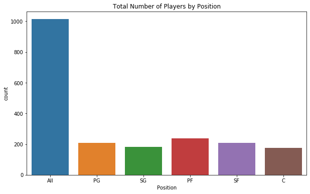

**Predictions of NBA Players&#39; Salaries Using Random Forest Classification**

**Abstract**

This paper analyzes my methods for predicting an NBA player&#39;s salary bin through various scikit-learn packages. It goes through multiple data cleaning methods and feature extractions to find the best way to predict what 20th percentile salary bin a player would fall into. The features that I selected made a Random Forest Classifier give the best model with a test accuracy of about 50%.

**Introduction**

NBA players are among the highest paid athletes in the world with an average salary of around $7.4 Million in 2019, while the NBA itself has an annual revenue of above $8 Billion. NBA players&#39; salaries are often brought into question regarding what the players are truly worth and how best to decide a price for them. Several factors go into the decision of a players&#39; value including team selection, draft pick, salary caps, contract length, and performance. I wanted to explore the performance aspect further and see if I could correctly predict what salary bin a player would be placed in after comparing his performance to that of his peers.

To accomplish this task of predicting an NBA player&#39;s salary bin, I utilized three datasets from ­[1](https://www.kaggle.com/pablote/nba-enhanced-stats)[2](https://www.kaggle.com/whitefero/nba-player-salary-19902017). The first dataset provided information about a player&#39;s performance, the second about a team&#39;s performance, and the third with salary data of players. They are attached in the data folder.

My initial approach was to predict a player&#39;s actual salary through a Linear Regression model using a multitude of calculated features. However, after an initial analysis with the RMSE and Ridge/Lasso Regression, there was no way for me to properly assess a player&#39;s salary because of factors other than performance. As a result, I trained Logistic Regression, Decision Tree, and Random Forest models with salary bins to see if I could group similar players. Through the different methods of multi-class classification, Random Forest modeling appeared to give me the best classification results.

**Description of Data**

As mentioned above, I took data from three different sources and used them to train and evaluate my model. The first data source I used was player performance per game for all the games in the seasons that they played. I coupled this with the salary data source grouped together on Name, Season, and Team. To see how those players performed compared to the rest of the players on the team, I used the third data source on the team&#39;s performance per game. I created new features based on the player&#39;s performance per game divided by the team&#39;s overall performance.

**Description of Cleaning Process**

The cleaning of the data I acquired was broken down into five parts. The first was an initial EDA to get a sense of the data, the next three required converting the three data sources I had into something usable, and the fifth was putting them all together and training the model.

**EDA**

In my initial EDA, I made a series of plots to help me understand the data better and see if my goal of creating a salary prediction model was even viable. In Figure 1, I made a scatter plot of the number of points a player made against the minutes that he played in the game. I grouped this against the Status of the player to see if there was a difference between benchers and starters. In Figure 2, I did a similar plot except I used Total Rebounds Made instead of Points to see if it was just points that differed between Statuses. Both Figures 1 and 2, allowed me to see how the correlation between the two groups was different and that I would have to later One Hot Encode this variable to get a better analysis. In Figure 3, I plotted the counts of the number of players by Position and Status to see if I should One Hot Encode Position as well. The graph I produced didn&#39;t directly show anything significant that I should One Hot Encode them, however it did show that the positions of Forward and Guard were very infrequently used so that I should look out for them when cleaning my data.

Figure 1

Figure 2

Figure 3

**Data Source 1**

The player data source I used was relatively clean in the beginning. To perform the analysis I wanted to, I need to get averages of the players performance throughout the season and then pair that with salary data as a single game doesn&#39;t dictate a player&#39;s salary but rather his performance throughout the year. To get how the player performed throughout the year, I had to create a column with the Year of the Season based on the game date. I also had to add 1 to the year because salaries in the NBA are defined before the player plays for the team, not after his performance. For example, a player&#39;s performance in the 2014 season would result in the salary he was given for the 2015 season. While doing this, I also wanted to find the age of an athlete and see if that might affect his salary as younger, newer players tend to earn less. Finding the age of a player took a significant amount of time as I could not just subtract his birth year from the season year. I had to take his age in relevance to all the games and then find the rounded integer based on the average across the games as I needed to see what the player&#39;s age was for the majority of the season. I settled on a method to do so but it was slightly off for all players due to the calculations based on leap years. This introduced a small bias within the Age feature in my data frame.

**Data Source 2**

After cleaning the player data source and renaming the column with clearer names, I sought to merge the data with the salary data. The salary data was clean for the most part except for the Team names which I found much later into my analysis. Because some players played on multiple teams throughout their career, merging the player data with the salary data produced redundant rows in my data frame differing by just the team name. To remedy this, I had to rename many of the team names in the player dataset according to their respective (and in some cases outdated) naming conventions in the other dataset. After putting all this information together and merging the data, I saw that the number of rows in my dataset had reduced significantly. I deduced that some of the players in the provided player dataset did not have corresponding salary information in the other dataset. I searched for new datasets to amend this problem but ran into the same issue with the other 4 datasets I tried. Ultimately, I found that the initial player dataset used wasn&#39;t conclusive in including all the players, nor were the datasets online as some players who only played a few games weren&#39;t included for the most part. This introduced some bias within my analysis as the available data to train and test my model was only a subset of the true data.

**Data Source 3**

The third dataset required a similar amount of cleaning as the first as both were of the same initial source. The purpose of this dataset was to provide a metric on how the player performed compared to the rest of his team throughout the course of the game. The computing of this metric was logically simple but took much time in computing as a result of differing data types and NaN values. The next stage of analysis with the dataset was deciding how to use the team&#39;s performance throughout the year (as better players tend to play on better teams and earn more money as a result). I decided to use a function to One Hot Encode variables on the number of wins and losses the team had per season and compute the result accordingly. I plotted the comparison of team&#39;s Winnings by average salary to produce the plot in Figure 4. This allowed me to see that I did not need to One Hot Encode the Team names to produce a feature that gave different teams higher salaries.

Figure 4

**Putting it all together**

The final stage in the data cleaning process came in deciding what types of information about the player to keep or to not keep and how to build my model. Many players played in different teams, positions, statuses (starter or bencher) through the season. This was because some players played more games for some teams, more minutes for others, made more points for another, and played different positions for each. I decided to select the team with which the player played the most games because that team would ultimately decide how much the player was worth in the end. Using this information, I computed the means based on the player, the season, his team, and his position. After using all of the features I had created, I trained a model but it was still not as good as I would have liked it to be. I plotted some more features against Positions to see how they differ and whether I should separate my model into parts by training them by Positions. I used Figures 5 through 11 to help me decide to separate the model by each position as a simple algebraic multiplication based on the position would not be able to fit all of the differing data into the model. After separating my model, I decided to explore how a feature such as Age and its relationship to the Salary Bins would change after separating my data. I visualized this and the number of players by Position in each Salary Bin in Figures 12 and 13.

Figure 5

Figure 6

Figure 7

Figure 8

Figure 9

Figure 10

Figure 11

Figure 12

Figure 13

**Description of Methods Used to Analyze Data**

In my initial analysis, I attempted to use a Linear Regression model with a wide variety of features to compute an average RMSE for the data set with cross validation considered. I decided that this wasn&#39;t the best way for me to predict a player&#39;s salary data as I wouldn&#39;t have a way to know how low my RMSE could go as the player salary ranges can go from 50,000 to 31,000,000. Putting these and computing the RMSE out of this would not give the best possible result, so I looked into using classification models.

I used bins edges by every 20th percentile because in my research about NBA player salaries I saw that players are typically classified as good and bad players through five ranks. Using this information to create bins, I tried three different models of Logistic Regression, Decision Trees, and Random Forests built from the player data source and salary data to compute my accuracy. Using these models, I got an accuracy of around 15% for the players in my test set. After seeing this, I did two steps to increase my model&#39;s performance. The first was to add in the third dataset as mentioned above. This increased my models&#39; general performance to around 30%, but I thought I could still do better.

The second step I took was to split the player data into the 5 positions on the court. Initially I assumed that all players are judged equally and evaluated equally, but I realized that different positions have different characteristics that make them good players. I plotted some of the differences to test my theory in the visualizations above. By separating the data into the five positions and computing the test set data accuracy based on five different models for each position, I got an accuracy of about 50% on a Random Forest model. This model became the best model I could compute based on the data sources that I used. I attempted to do some more manipulations across the data including selecting more features, algebraically manipulating them, iterating through all possible combinations of features to figure out the best ones to use. However, those manipulations did not improve my model more than what I initially had.

**Summary of Results**

I utilized NBA player data, team data, and salary data to compute a Random Forest Classification model to classify players into bins that roughly represent every 20th percentile of player salaries from 0 to 32,000,000. The encompassing model was built around 5 smaller models built from individual positions on the court. I trained this model with 80% of the cleaned data and tested with 20% of the data, achieving roughly 50% accuracy rate on the test data.

One of the assumptions I made when creating my model is that the rate of the dollar has been consistent throughout the seasons. I did not adjust the data for inflation because the data source did not specify whether the data already had been adjusted. Another assumption I made was that players did not enter contracts with their teams based on a fixed salary and that all teams had the same capital. I treated each player and their salary as something which was based solely on their performance and nothing else (meaning no salary caps or rookie wage contracts). This was because of the lack of available information I had on the subject and because it was unique to each player. Moreover, I also assumed that there was no salary discrimination in the league as there was no way for me to account for these types of bias within the data.

To get an even higher accuracy, some of the other features I would like to have used would be the number of years a player has been in the NBA, the draft pick of the player when he first entered the league, and the previous contracts and its salary, as well as contract length. This information is generally unique to each player and is difficult to find complete datasets on this. I tried to use college statistics in the beginning of my analysis, but there were not that many players in both the player and college datasets together. Additionally, the salary cap of the team and the salary minimum for veteran players would also impact how much a team can give a player.
